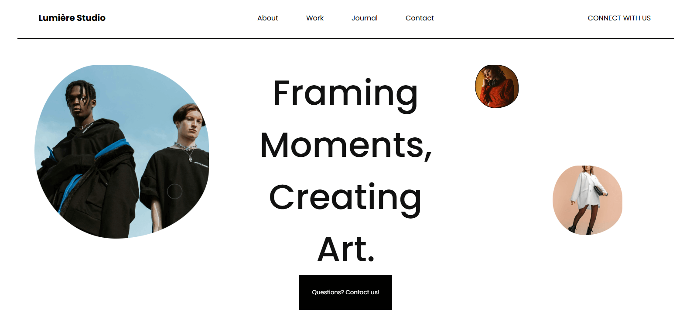
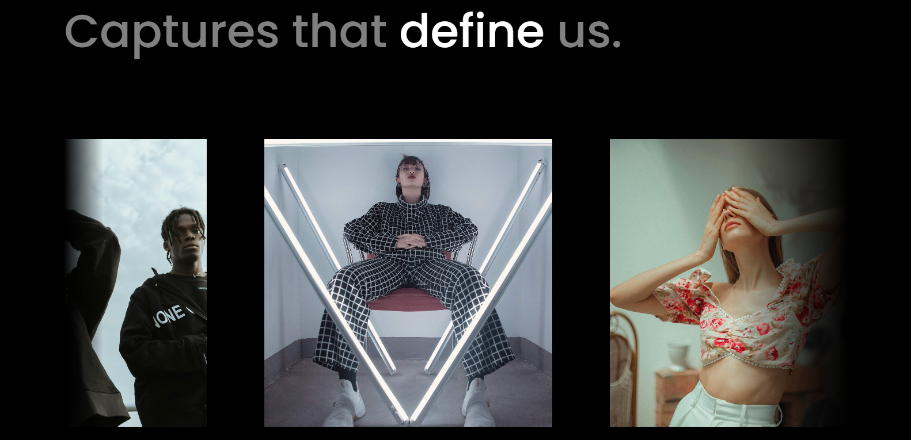

# **Photography Agency Landing Page**

This project is a **modern** and **minimalist landing page** built for a photography agency, designed to make a **bold visual impact**.  
Developed using **HTML, CSS, and JavaScript**, the website delivers a **smooth and engaging experience** through thoughtfully crafted animations and responsive design.

---

# **Key Features**

- **GSAP animations** for dynamic transitions and scroll effects  
- **AOS (Animate On Scroll)** for subtle and elegant fade-in animations  
- **Custom animated cursor** that smoothly follows the user's movements, adding a unique interactive touch  
- **Responsive design**, perfectly adapting to all screen sizes for seamless browsing  
- **Black and white color palette** for a clean, high-end aesthetic  
- **Smooth hover effects** that bring content to life while maintaining a minimalist look  
- **Animated image slider** created with HTML and CSS keyframes, featuring smooth transitions  
- **Pause-on-hover effect**: when hovering over an image in the slider, the animation pauses and that specific image retains its color while the others turn black and white — drawing the viewer’s focus to the image under the cursor

---

This landing page combines **creative design** and **advanced front-end techniques** to showcase the agency’s visual identity in a **professional** and **captivating** way.

# **📸 Project Screenshots**

